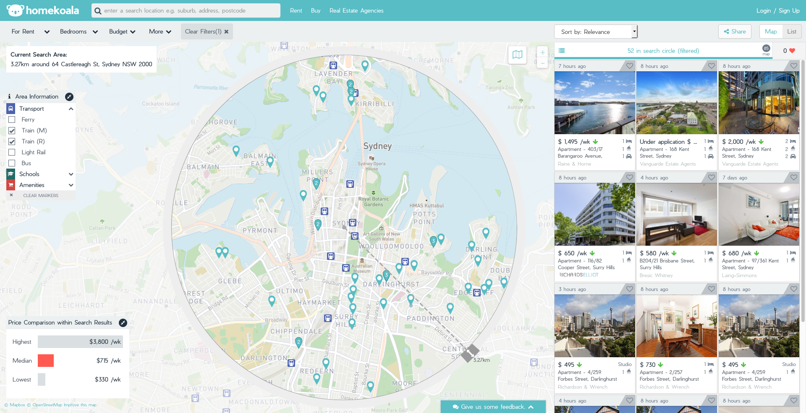
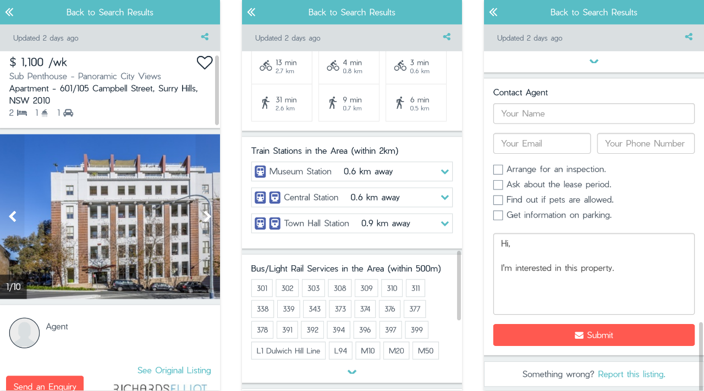

## A little about myself 
I first joined Homekoala in 2015, due to my interest in working for a start-up. While I had close to zero technical
chops in software, it was something that I had always been interested in during my early teens, as most of us were growing
up in the 2000s. As my grades in mathematics and science declined, I believed that I was more suited for a career in the
field of arts and humanities and carried it as a self-fulfilling prophecy for almost a decade to follow. 

___

## Background of Homekoala

Homekoala was a real-estate search engine, designed to help Australians "Find The Right Home", it was built during a time
when real estate search portals were clunky and difficult to navigate. Users typically had to go through multiple pages of
listings just to find the desired property. In addition, mobile versions of those portals were far from modern web standards.
We felt that it was an undesirable experience and thought that we could do something better.

___ 

Initially, I was in-charge of the social media outreach and online marketing efforts. This meant understanding how social
media marketing worked. Eventually, I joined in on the redesign of the entire interface, as we believed in the idea that
a better user interface and user experience would bring about the users that were needed to elevate the business. We were
wrong.

We spent many hours building features that we felt were impressive from a technical standpoint. Users could access our 
web platform and interact with numerous features, all designed to help them 'Find The Right Home'. There was a circle
that you could click and drag to narrow down your search radius based on distance, and filters that even allowed you
to only view results that were within walking distance to nearby supermarkets. Yet our user numbers would hover at
thousands per month and plateau. 

As the team only comprised of 3 full-time members, each build cycle took us an approximately three to four months, 
complete with testing. We wasted far too much time internally, debating the placement of visual elements, blindsided by
the fact that having a nicer user interface was not going to save us. This is where I learnt a hard lesson on design.
**Design is what works.** During this critical growth phase, if your platform delivers what the user wants, it does not 
matter if a certain visual element is out of place. As Augustus Welby Northmore Pugin, the designer behind the Palace of 
Westminster put it,
> *“It is alright to decorate construction but never construct decoration.”*

As the months wore on, we were locked in our development cycle, churning feature after feature, burning both time and money.
We continued to believe that so long as we delivered a superior product compared to our competitors, people would come on-board
and our lady luck would smile our way. We felt that once the users arrived, we would be able to convince the investors
that it was a project worth funding.

Eventually, we had to call it quits. There was simply not enough money left to sustain the company and we had to stop.

In hindsight, I learnt a great deal on what should not be done when trying to get the company past the initial growth
phase. 

**1. Focusing too much on the product and not enough on revenue.**

While we believed the importance of revenue, the way we felt we could obtain it was fundamentally skewed. We
were competing in a market that was practically monopolised and had no way to fight against their advertising budget.
Great features were not going to save us. 

**2. Do not aim for pixel perfection. It is a process, not a destination.**

Your product is as ready as it ever will be. There will always be bugs to fix, new features to design. If people find your
product useful, they will be more than willing to tolerate that few quirks. If you feel sufficiently bothered by it, reach
out to them, apologise. People are more than inclined to forgive and forget. Find the minimum viable product and get out 
there. Talk to as many people as possible, find ways to get people on board. Most importantly,find ways to retain them 
and grow your product.

#### Further Readings
I have learnt a great deal from these books and I hope they do the same for you. 
While they are not related to digital design, I have found them invaluable in helping me grow as a designer and person.

* The Visual Display of Quantitative Information - Edward R. Tufte
* Envisioning Information - Edward R. Tufte
* Dieter Rams : As Little Design As Possible - Jonathan Ive, Klaus Kemp, Sophie Lovell
* Design Systems - Alla Kholmatova

If you are interested in the work of Dieter Rams, I suggest taking a look at his [documentary](https://www.hustwit.com/rams/), 
which include in-depth conversations with Dieter, and dive deep into his philosophy, his process, and his inspirations.