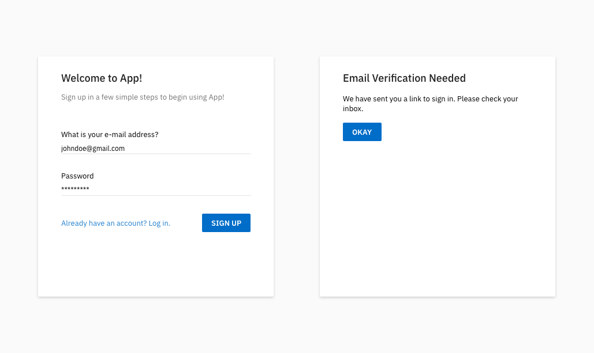
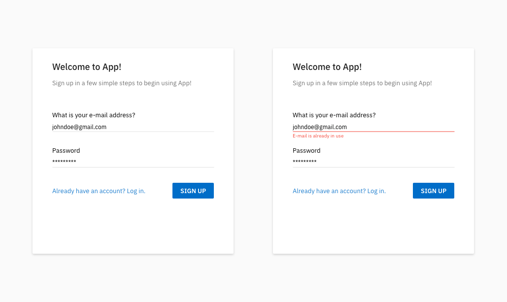

Some time last year, I worked on a sign up flow with my colleague. We drafted out some typical scenarios that a sign up flow encompasses and got cracking.

As we did not have to consider the social sign up aspects, here are the scenarios we came up with: 

* Pre sign up
  * Sign up 
   * Account does not exist

* Post sign up
   * Account not verified (link not expired)
   * Account not verified (link expired)
   * Account verified (login)
   * Normal login

* Account verified
   * Wrong password
   * Wrong password (max attempts)
   * Reset/forget password
   * Reset password (link not expired)
   * Reset password (link expired)

Then, I began work on crafting the mock-ups. It would serve as a reference point and also a checklist on the scenarios to be covered.

Here comes the interesting bit. About 5 - 6 months after completing this entire flow, I came to a sudden realisation that I missed out one important point one while having a chat with my colleague with decades of programming experience.

He asked:

 >"What happens if a person signs up, but does not verify his account?" 
 
 I pointed to the Robo 3T (Mongo DB GUI) on my screen and said:
 
 >"It gets stored in the user object within the database"

Notice the point I missed? While working on my screen mock-ups, I failed to consider the fact that a real accounts might be registered by people other than the users themselves. Take for example, someone decides to sign-up with the account, `johndoe@gmail.com`. The real person, John Doe, might be oblivious to your app's existence. As such, he never ever checks the verification mail that was intended for him.

What happens when the real John Doe decides to sign up for your app one day? He will proceed to the sign up page, type in his e-mail and desired password, then click on the "SIGN UP" button. Here's what will happen:

___

This is poor execution. Now, poor John Doe has to figure out why his e-mail is already in use when he has never ever signed up for your app prior to this.

## What should have been done?
The users should not have been stored within the database in the first place. Instead, consider a voucher that expires if not activated. Tie an expiry to the verification e-mail. If the user fails to verify the account within a set time, invoke the validity of voucher. On the front-end, this would treat the user as though he has never ever signed up. For example, set a 24 hour expiry on the verification e-mail. If it expires and there is an re-attempt to sign up with the e-mail address, it will simply prompt the user to check his inbox for a verification e-mail.

## Talk to your developers
Spend some time to understand how different facets of the entire process works, from database storage to the front-end user interface. This will help you avoid mistakes such as this and be a better designer. 

## Consider real world processes
Suppose you are running a sign up booth for an event. John Doe comes up to your booth, indicates that he is interested to sign up for the event. What do you do? You proceed to determine his certainty, then ask for his particulars. You may request for some form of identification card to ensure that it is indeed the real John Doe.  

What if another person who claims to be John Doe indicates his interest? It would be foolish to sign this person up without verifying his identity.

___

A copy of the sign up flow can be downloaded over [here](https://github.com/havesomeleeway/havesomeleeway.github.io/raw/master/_mockups/generic_signup.xd). I created it in Adobe XD and you are free to maniupulate, study, re-use it in anyway you deem fit. Don't have adobe XD? Check out the working prototype on your browser over [here instead](https://xd.adobe.com/view/881505d9-e864-41c1-be2a-bc10d2b398cb). 